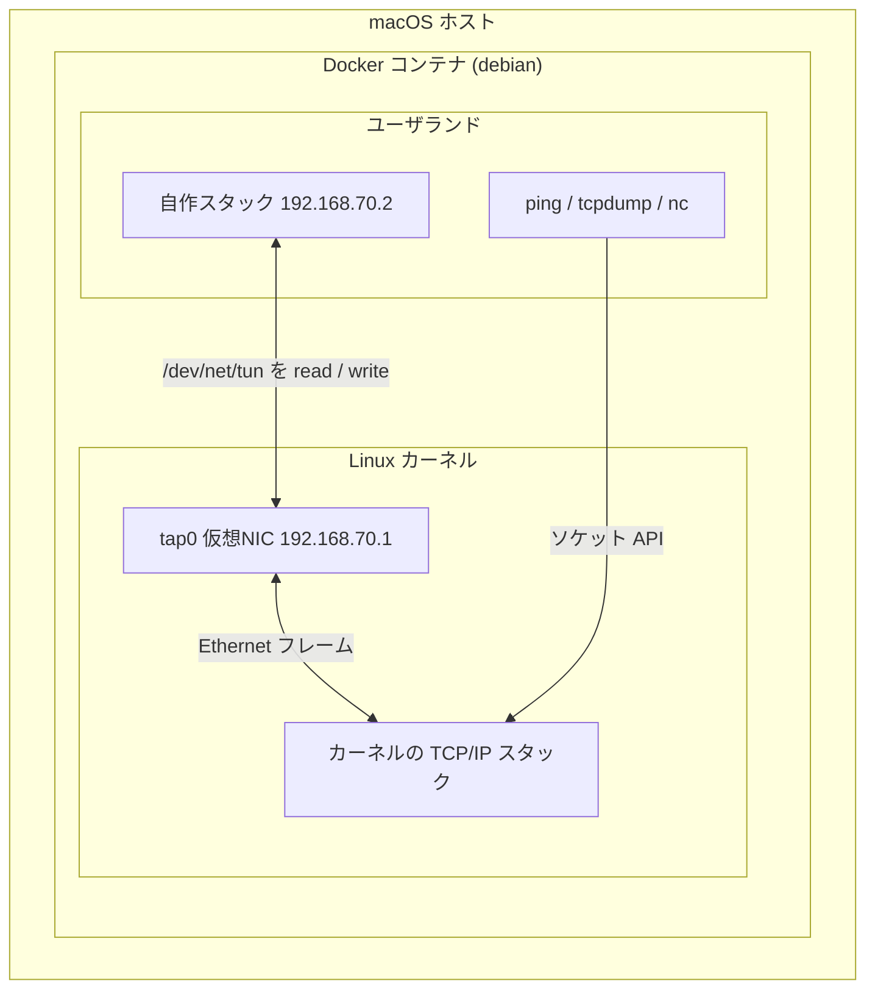
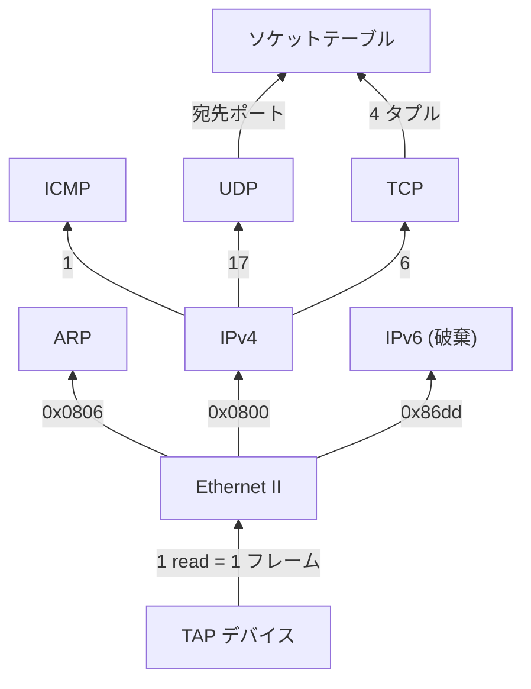
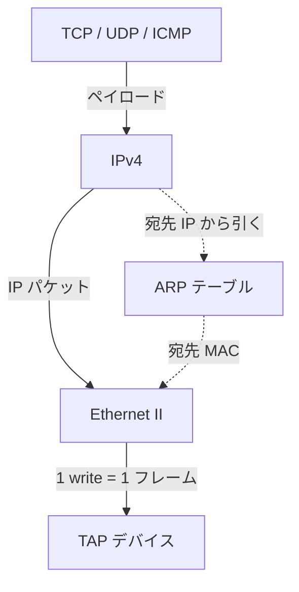

# tcpipz

Zig で TCP/IP プロトコルスタックをスクラッチから自作する学習プロジェクト。OS のソケット API に頼らず、TAP デバイスから読んだ生の Ethernet フレームを自前でパースし、ARP から TCP まで積み上げる。

対向の Linux カーネルから見ると 1 台のホストとして振る舞う。

- `ping 192.168.70.2` が応答を返す
- `nc -u 192.168.70.2 7` で UDP echo が返る
- `nc 192.168.70.2 8080` で TCP 接続が確立し、データを送受信できる

## 実行環境

- `tap0` はカーネルから見れば本物の NIC。違いは向こう側にケーブルではなくこのプログラムがいること
- IP`192.168.70.1` は `ip addr add` でカーネルが `tap0` に付与したもの
- IP `192.168.70.2`、MAC `02:00:00:00:00:02` は自作スタックのコード内で自称しているだけで、カーネルは存在を知らない。MAC の先頭 `0x02` はローカル管理ビットで、実在の NIC と衝突しないことを宣言している
- カーネルが `tap0` へ送ったフレームは `/dev/net/tun` の fd から `read` で取り出せる。`write` したものはカーネルには「`tap0` が受信したフレーム」に見える
- `ping` / `tcpdump` / `nc` はカーネル側のソケット API を使う。自作スタックとは別経路でカーネルに入り、`tap0` を通って対向として届く
- `/dev/net/tun` を開いて TAP を作るには `NET_ADMIN` ケーパビリティとデバイスのマッピングが要る（`compose.yaml` で設定済み）

## 受信経路

- 各層には「ペイロードを誰に渡すか」を決めるフィールドが 1 つある。矢印のラベルがその値
- Ethernet は EtherType、IPv4 はプロトコル番号、L4 はポート番号 — 見る場所が違うだけで判断の形は同じ
- TCP だけポートではなく 4 タプル（送信元 IP・ポート / 宛先 IP・ポート）で識別する。同じ待ち受けポートに複数の接続が同時に来るため
- IPv6 はカーネルが新しいインターフェースを認識すると勝手に近隣探索を始めるため受信するが、このスタックでは扱わず破棄する

## 送信経路

- 受信の逆をたどるが、点線の 1 本だけが構造上の例外。IPv4 は宛先 MAC を知らないので、フレームを組む前に ARP に問い合わせる必要がある
- **ここだけ上位層が下位層に依存する。** ARP を IPv4 より先に実装するのはこの向きによる
- 未解決なら ARP 要求をブロードキャストし、応答が返るまでそのパケットは送れない

---

実装の順序と各ステップの狙いは [ROADMAP.md](ROADMAP.md)、環境構築と開発時の約束事は [CLAUDE.md](CLAUDE.md) にある。
