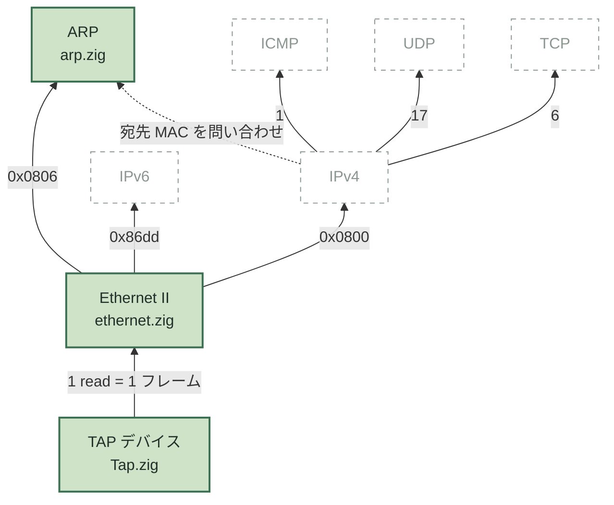
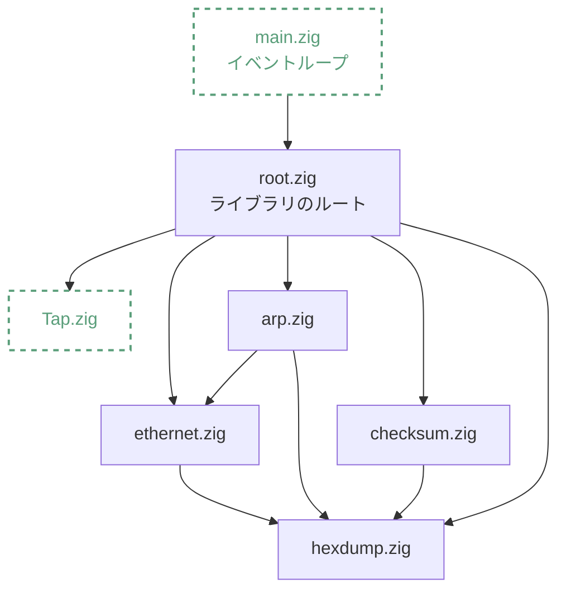

# tcpipz

Zig で TCP/IP プロトコルスタックをスクラッチから自作する学習プロジェクト。OS のソケット API に頼らず、TAP デバイスから読んだ生の Ethernet フレームを自前でパースし、ARP から TCP まで積み上げる。

現在 **Step 6 / 24**（ARP パケットのパースまで）。

## 受信経路

TAP から読んだフレームが、どのフィールドを見てどの層に渡されるか。



実線が実装済み、破線の枠が未実装。矢印のラベルは分岐に使う実際の値。

**同じ多重分離が層をまたいで繰り返される。** Ethernet は EtherType、IPv4 はプロトコル番号、L4 はポート番号 — 見るフィールドが違うだけで「1 つの値で上位層を選ぶ」という判断の形は同じ。新しい層のパーサを書くときは、この型に当てはめて考えられる。

例外は点線の 1 本だけ。IPv4 は送信時に「この IP の MAC は何か」を ARP に尋ねる必要があり、**ここだけ上位層が下位層に降りていく**。ARP を IPv4 より先に実装するのはこの依存の向きによる。

IPv6 はカーネルが新しいインターフェースを認識すると勝手に近隣探索を始めるため受信はするが、このスタックでは扱わず破棄する。

## モジュールの依存



破線が I/O を持つモジュール、実線は純粋関数のみ。パースとシリアライズを I/O から分離してあるので、プロトコル部分は TAP 無しでテストできる（`zig build test` はホストの macOS でも通る）。

`hexdump.zig` にバイトオーダー変換が集まっているのは、ネットワークバイトオーダーとの変換を 1 箇所に閉じ込めるため。上位層が増えても依存の向きはここへ集まる。

## 実装済みの層

| モジュール | Step | 内容 |
|---|---|---|
| `hexdump.zig` | 1 | 16 進ダンプ、ビッグエンディアンの読み書き |
| `checksum.zig` | 2 | インターネットチェックサム (RFC 1071) |
| `Tap.zig` | 3 | TAP デバイスの open / read / write |
| `ethernet.zig` | 4–5 | Ethernet II フレームの解析・構築 |
| `arp.zig` | 6 | ARP パケットのパース (RFC 826) |

残り 18 ステップの一覧と各ステップの狙いは [ROADMAP.md](ROADMAP.md) に、環境構築と開発時の約束事は [CLAUDE.md](CLAUDE.md) にある。

## 動かす

TAP デバイスは Linux 専用なので、実行はコンテナ内で行う。

```sh
docker compose up -d
docker compose exec dev bash

# コンテナ内で TAP を用意（初回のみ）
ip tuntap add dev tap0 mode tap
ip addr add 192.168.70.1/24 dev tap0
ip link set tap0 up

zig build run
```

別のシェルから `ping 192.168.70.2` を叩くと、カーネルが送ってくる ARP 要求がパースされて表示される。

```
--- 42 bytes  de:da:6c:00:2b:9c -> ff:ff:ff:ff:ff:ff  ARP ---
who has 192.168.70.2? tell 192.168.70.1
```

まだ応答は返さないので `ping` は通らない。ARP 応答は Step 7。

ユニットテストは TAP を使わないため、ホスト側でそのまま実行できる。

```sh
zig build test
```
