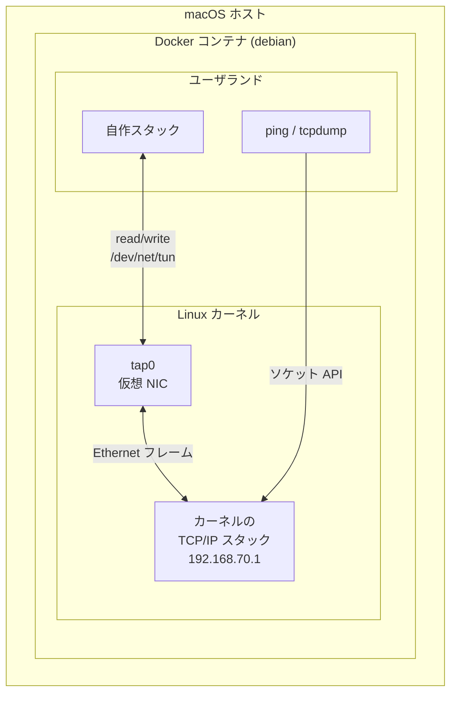
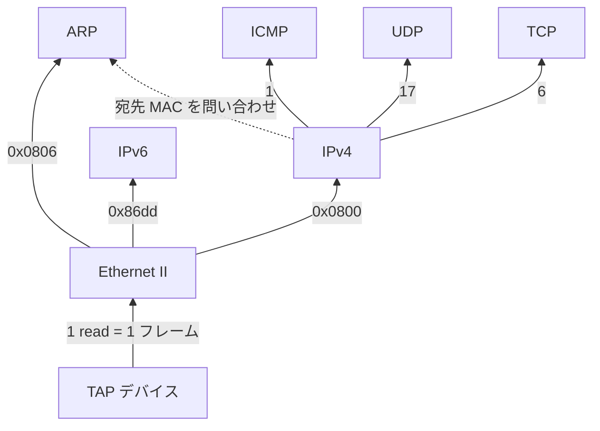

# tcpipz

Zig で TCP/IP プロトコルスタックをスクラッチから自作する学習プロジェクト。OS のソケット API に頼らず、TAP デバイスから読んだ生の Ethernet フレームを自前でパースし、ARP から TCP まで積み上げる。

## 実行環境

- `tap0` はカーネルから見れば本物の NIC。違いは向こう側にケーブルではなくこのプログラムがいること
- カーネルが `tap0` へ送ったフレームは `/dev/net/tun` の fd から `read` で取り出せる。`write` したものはカーネルには「`tap0` が受信したフレーム」に見える
- だから対向で `ping` や `tcpdump` がそのまま動く
- コンテナに `NET_ADMIN` と `/dev/net/tun` のマッピングが必要（`compose.yaml` で設定済み）
- キャリアが立つのはこのプログラムが fd を開いている間だけ。起動していなければ `ip link` は `NO-CARRIER` を表示する

## 受信経路

- 各層には「ペイロードを誰に渡すか」を決めるフィールドが 1 つある。矢印のラベルがその値
- Ethernet は EtherType、IPv4 はプロトコル番号、L4 はポート番号 — 見る場所が違うだけで判断の形は同じ
- 点線だけが例外。IPv4 は送信時に宛先 MAC を ARP に尋ねるため、ここだけ上位層が下位層に降りる。ARP を IPv4 より先に実装するのはこの依存の向きによる
- IPv6 はカーネルが勝手に近隣探索を始めるため受信するが、このスタックでは扱わず破棄する

---

実装の順序と各ステップの狙いは [ROADMAP.md](ROADMAP.md)、環境構築と開発時の約束事は [CLAUDE.md](CLAUDE.md) にある。
